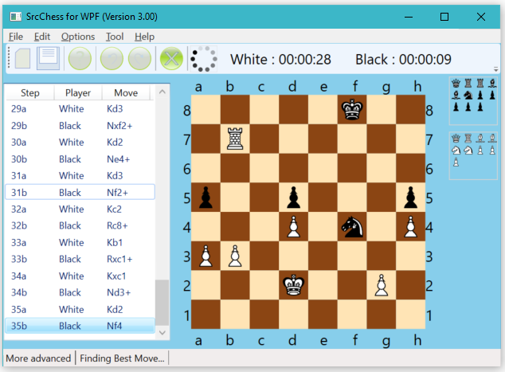
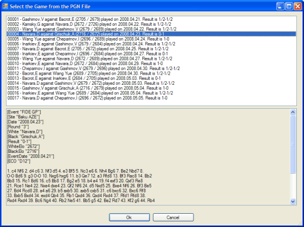
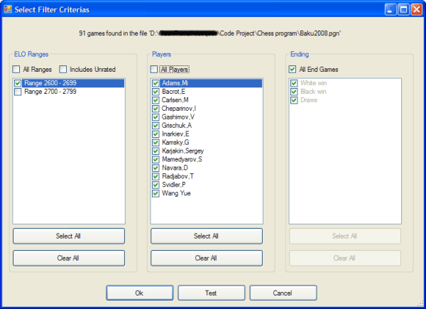

# Chess Program in C#

This isn't some other SharpChess: This is Jacques Fournier's (GPLv3) formerly named SrcChess with 2D graphics (using WPF).

## Differences in Poikilos' fork
I do not maintain this program, only this repo. If you have an issue, please contact the original author using the article link at the bottom.
- This readme file is new (the old readme became the changelog).
  - Move the changes before 1.0 from here to the bottom of the changelog.

Sections below summarize the author's description on codeproject.com. The feature list is quoted.

## Introduction
SharpChess makes use of multiple processors but has a primitive board evaluation program and no endgame database. It can import PGN files for building an openings book.

This project welcomes code contributions.

Sections below are directly from the original article, which the original author released according to the license as he stated below. The "Versioning" section was merged into the changelog file as described above. The License section and copyright statement was moved to a new Author & License section.

## License
"This article, along with any associated source code and files, is licensed under The GNU General Public License (GPLv3)"
"Article Copyright 2009 by Jacques Fournier"

## Features
- Visual interface
- Multiple difficulty levels
- Database of book openings
- Loading / saving of game
- Undo / redo functions
- Reversing the board
- Player against computer
- Computer against computer
- Player against player
- Creating your own chess board (manually or from PGN)
- Hints for the player

## Behind the Board

The program is developed in C# using Visual Studio 2010. It uses the alpha-beta pruning search algorithm (and minimax for debugging) to search for the next best move. To decrease the number of moves to evaluate, the search algorithm uses a transposition table implemented with Zobrist hashing.

To further improve the performance of the search, the program uses one thread per processor found on the computer and splits the search among them (finally a use for the multiple processors on my computer...). The search threads are low priority so as not to disturb too much the computer response.

The program uses a database of book openings. The one provided with the game was built from PGN files. The program also provides a PGN parser so you can build your own openings database using an option on the Tool menu. The parser also allows you to replay chess games downloaded from the Web in PGN format.

## Building an Openings Book
A database of book openings is provided with the program. You can build your own openings book from any PGN file (easily found on the Web).

The program includes a parser that allows you to import and filter the content of a PGN file according to parameters such as players or rankings. This filtered version of the PGN file can also be saved and used to create an openings book.

The openings book must be located in the directory containing the executable and named book.bin.

## What Needs to be Improved?
The board evaluation function is minimalist. Improvements on this function will greatly enhance the level of playing of the program. Similarly, the end game stage of the program could benefit from the inclusion of an end game database.

There is no rating among the different openings; an opening is thus chosen randomly.

Improvements can also be made on the user interface. Adding a help file to the game would be welcome.

## Source Description
A chess program is not very complex in itself. But like a lot of software, the devil is in the details. This chess program contains around 10,000 lines of codes (including remarks). The user interface is separated from the other classes so it can easily be changed.

The `ChessBoard` class is the most important since it contains the board abstraction. It also contains the logic to build the list of legal moves and to search for the best move. A little extra complexity was added to support multi-threading. However, the class is relatively small (less than 2000 lines). To improve the speed of the search, a list of legal moves for each {piece, piece position} is created once in the static constructor of the class.

- `ChessBoard`: Class constructor
- `CopyFrom`: Copy a board into another one
- `Clone`: Create a clone of the board
- `ReadBook`: Read an openings book from a file
- `SaveBoard`: Save the board to a stream
- `LoadBoard`: Load the board to a stream
- `ResetBoard`: Reset the board to initial position
- `this[int iPos]`: Default indexer, get or set a piece on the board
- `GetEatedPieceCount`: Return the number of pieces which have been captured for a given color
- `DoMove`: Do the specified move
- `UndoMove`: Undo the specified move
- `WhitePieceCount`: Number of white pieces on the board
- `BlackPieceCount`: Number of black pieces on the board
- `IsCheck`: Determine if a given color king is being directly attacked
- `EnumMoveList`: Enumerate all the possible moves for a given color
- `FindBestMove`: Find the best move for a given color using alpha-beta or minimax
- `FindBookMove`: Find a move in the openings book
- `GetHumanPos`: Return a human readable move from a move structure
- `CancelPlay`: Cancel the background search

The core logic of the search lies in the alpha-beta pruning function. This function can be used in two modes:

- Specific number of ply
- Iterative deepening depth-first search

The first method searches for the best move in a specified number of ply.

The second one tries to find the best move in a specific amount of time using an iterative depth-first search, increasing the number of ply for each search up to the moment when time is exhausted. At first glance, this method may seem less efficient since it performs the same search repeatedly. But in practice, the method reorders the moves between each search to optimize the alpha-beta cut-off. Another big advantage of this method is that the number of ply can be adjusted depending on the stage of the game. In particular, the end game holds fewer pieces on the board, so increasing the number of ply doesn't have the same impact as doing so in the middle of the game.

The following lists the source files and description. The number of lines appears in brackets after the name of the file. The code has a total of 9836 lines.

- *Assembly.cs* (34)
  Assembly file for .NET application.

- *Book.cs* (359)
  Implements the book openings.

- *ChessBoard.cs* (1990)
  Implements the chess board regardless of the user interface. This is where the core logic of the program lies (search, legal moves, etc.). The search function is implemented using minimax and alpha-beta algorithms, using multi-threading when possible.

- *ChessControl.cs* (1510)
  User interface for the chess board. Implemented as a UserControl.

- *ChessControl.Designer.cs* (86)
  Visual Studio generated code for the control.

- *frmAbout.cs* (16)
  About dialog box.

- *frmAbout.Designer.cs* (110)
  Visual Studio generated code for the form.

- *frmChessBoard.cs* (1236)
  Main form containing all the other controls (ChessControl, MoveViewer, etc.).

- *frmChessBoard.Designer.cs* (499)
  Visual Studio generated code for form.

- *frmCreatePGNGame.cs* (114)
  Interface to convert a PGN file into a book openings database.

- *frmCreatePGNGame.Designer.cs* (97)
  Visual Studio generated code for the form.

- *frmGameParameter.cs* (165)
  Parameters of the game.

- *frmGameParameter.Designer.cs (218)
  Visual Studio generated code for the form.

- *frmPGNFilter.cs (340)
  Parameters for filtering a PGN file.

- *frmPGNFilter.Designer.cs (309)
  Visual Studio generated code for the form.

- *frmPGNGamePicker.cs (209)
  Choosing from PGN game.

- *frmPGNGamePicker.Designer.cs (103)
  Visual Studio generated code for the form.

- *LostPiecesControl.cs (299)
  Control used to show the captured pieces.

- *LostPiecesControl.Designer.cs (63)
  Visual Studio generated code for the control.

- *MoveViewer.cs (192)
  Control used to show the moves.

- *MoveViewer.Designer.cs (87)
  Visual Studio generated code for the control.

- *PGNParser.cs (765)
  Parser for PGN notation.

- *PgnUtil.cs (816)
  Utility class for PGN files.

- *Program.cs (21)
  Main program.

- *TransTable.cs (232)
  Transposition table implementation.

## Short Glossary
All terms can be easily found on the Web (Wikipedia is a good source).

### Ply
A ply consists of a half move (a move of one side only). A 4-ply search means to search 2 moves in advance.

### PGN
Portable Game Notation, or PGN, is a notation used to record chess games. PGN is widely used as it is easy to read by users and to process by computers. Many chess games and events are published in the PGN format. The parser allows the chess program to read these files.

### Minimax
Minimax is a recursive algorithm use for choosing the next move in a game. A tree of legal moves is built and played. Each move is evaluated using an evaluation function. The computer makes the move that maximizes the minimum value of the position resulting from the opponent's possible following moves.

### Alpha-beta Pruning
The alpha-beta pruning function is an improvement of the minimax search method. It reduces the number of nodes to evaluate by eliminating a move when at least one possibility was proved worse than a previously evaluated one.

### Transposition Table
A transposition table is a hashing table that records the previous moves' evaluations so they will not have to be re-evaluated. Transposition tables are used to speed up the search of the game tree. They are implemented using Zobrist hashing .

### Zobrist Keys, Zobrist Hashing
To implement a transposition table, it is important to determine if two boards are equivalent in configuration and in potential moves. To do so, we can just compare the pieces of the two boards, but we must also take into account castling and en-passant moves, as they constrain possible moves. The only problem is that this method is a quite long when considering it has to be used millions of times to evaluate each move. Zobrist hashing simplifies this process by assigning each board position a 64-bit signature; instead of checking each piece one by one to see if the board has already been evaluated, we just compare the two 64-bit values.

## About the Author

Jacques Fournier, Team Leader Consyst SQL, Canada

Consyst is a dynamic IT company specialized for more than 20 years in information technology architecture and in the development of innovative productivity tools for businesses. Rep++, the product at the core of its mission, can significantly accelerate the development cycle of applications and services by reducing the duration of the design, coding, testing and maintenance stages.

Rep++ uses a model-driven approach supported by a powerful model execution mechanism. Essential complement to Visual Studio® (Microsoft®), Rep++ includes: an open and centralized model that is used to define, contain and manage all the metadata of an application set; toolkits and application frameworks that implement various flavors of the presentation layer; and specialized assistants that simplify the creation of applications and services for a variety of architectures and technologies. These elements provide a very high automation level, which enable businesses to focus their development efforts on where it counts: their business rules.

## Comments and Discussions
Comment 198 messages have been posted for this article Visit <https://www.codeproject.com/Articles/36112/Chess-Program-in-C> to post and view comments on this article, or click here to get a print view with messages.

## Development
- IDE: C# using Visual Studio 2010
